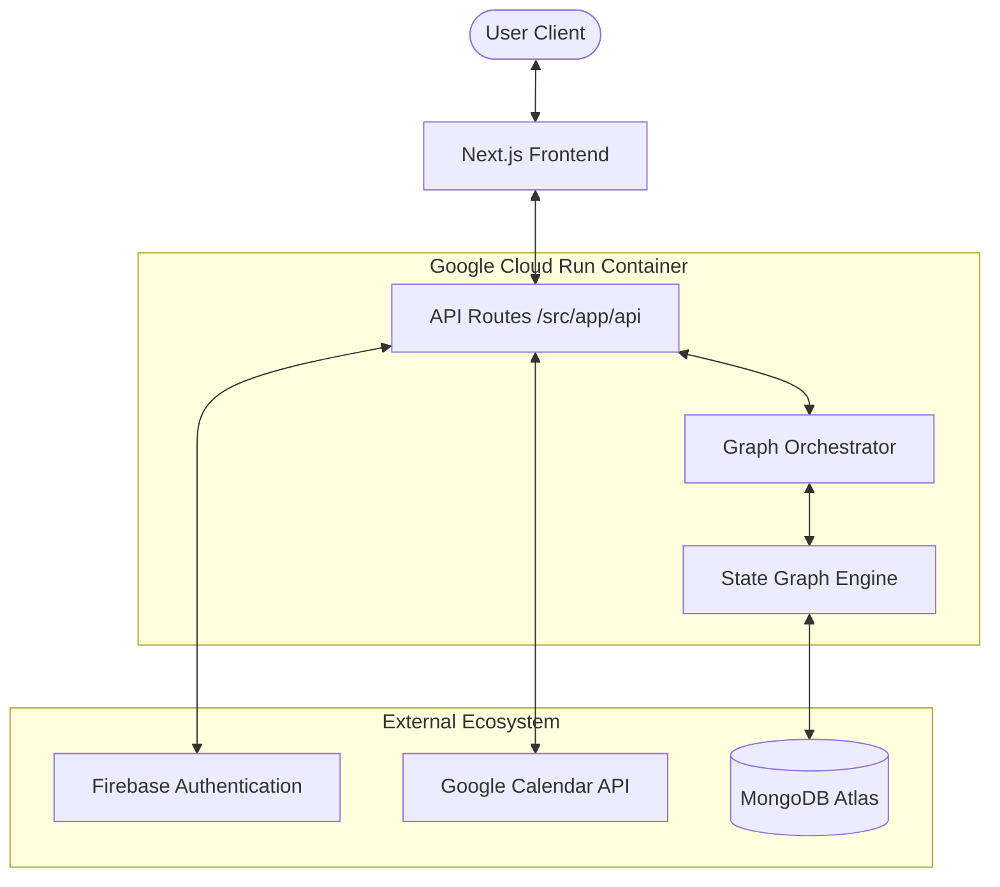
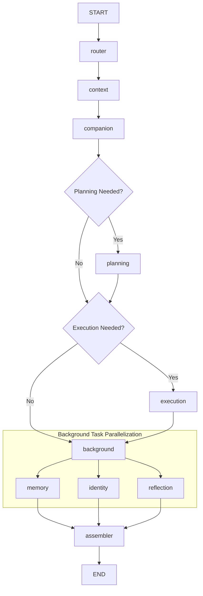
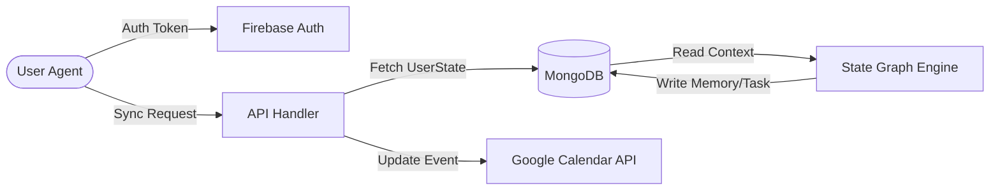
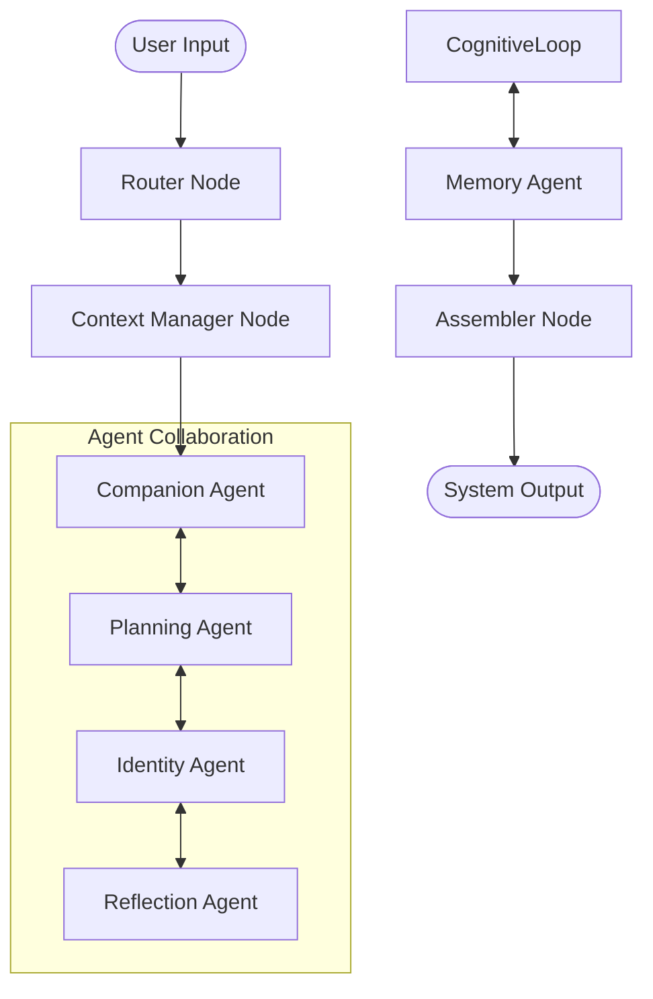
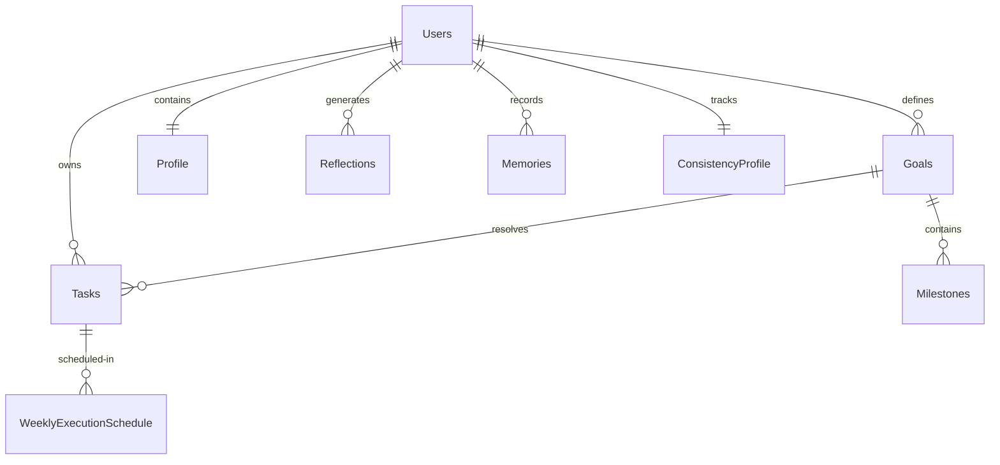
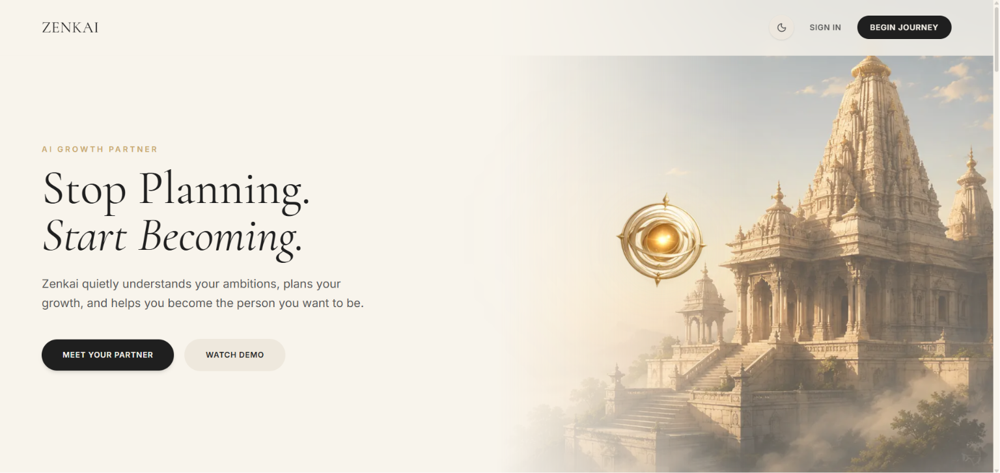
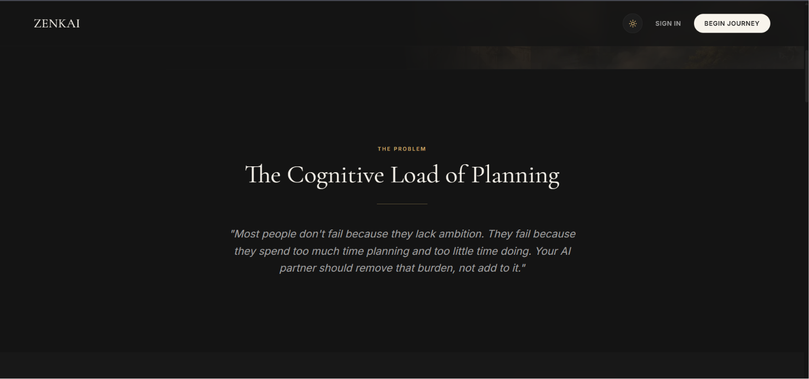

# Zenkai

### An AI-first life operating system that transforms long-term goals into adaptive execution systems.

# Why Zenkai?

Imagine having an AI companion that doesn't just answer questions—but remembers your goals, adapts your plans when life changes, syncs your calendar, and continuously helps you become the person you want to be.

That's Zenkai.

Instead of being another chatbot or to-do app, Zenkai acts as an adaptive life operating system powered by a persistent multi-agent architecture.


[](https://nextjs.org/)
[](https://www.typescriptlang.org/)
[](https://firebase.google.com/)
[](https://www.mongodb.com/)
[](https://ai.google.dev/)
[](https://cloud.google.com/run)
[](https://developers.google.com/calendar)
[](LICENSE)

## Live Demo

🌐 **Live Application:** [https://zenkai-852596217532.asia-south1.run.app]

🎥 **Demo Video:** [<YouTube placeholder>](<YouTube placeholder>)

💻 **Repository:** [https://github.com/achyutpandey1212-source/Zenkai.git](https://github.com/achyutpandey1212-source/Zenkai.git)

---

## Google AI Stack

Zenkai is powered by the Google AI stack to deliver a stateful and context-aware planning interface:
* **Gemini API:** Serves as the core cognitive model powering the multi-agent planning and reflection system.
* **@google/genai:** The official SDK utilized to execute structured schema outputs and system instruction configurations.
* **Google Calendar API:** Enables bidirectional synchronization between Zenkai's database and the user's real-life commitments.
* **Firebase Authentication:** Handles secure user authentication and Google OAuth integration.
* **Google Cloud Run:** Hosts the containerized Next.js serverless application.

---

Zenkai is a self-evolving cognitive life operating system that bridges the gap between high-level human aspirations and daily scheduling. Rather than functioning as a static to-do list, Zenkai runs a stateful multi-agent system built around a custom stateful multi-agent orchestration engine. It continuously observes user execution patterns, updates a persistent behavioral and identity model, and programmatically adjusts schedules and goals. Through bidirectional Google Calendar synchronization and contextual agentic feedback, Zenkai transforms planning from a manual chore into an adaptive, self-improving feedback loop.

---

## ⭐ Hackathon Highlights

Zenkai was architected and built to push the boundaries of stateful, multi-agent orchestrations.
* **Built for the Google AI Hackathon:** Deep integration with Google's ecosystem and APIs.
* **Gemini-Powered Multi-Agent System:** Built on a custom graph engine using the `@google/genai` SDK for low-latency structured outputs.
* **Deployed on Google Cloud Run:** Scalable, containerized backend hosting running inside a fully managed environment.
* **Firebase Authentication:** Multi-factor secure user authentication utilizing Google OAuth.
* **Google Calendar Integration:** Bidirectional synchronizations reflecting dynamically mutated execution schedules.
* **Persistent Identity & Reflection Engine:** Stateful feedback loops that run background evaluation models to continuously update behavior profiles.
* **Production Deployment:** Fully optimized Dockerized container pipelines running with strict security headers.

---

## Table of Contents

- [Live Demo](#live-demo)
- [Google AI Stack](#google-ai-stack)
- [Problem](#problem)
- [Solution](#solution)
- [Key Features](#key-features)
- [Architecture](#architecture)
- [Tech Stack](#tech-stack)
- [Folder Structure](#folder-structure)
- [How It Works](#how-it-works)
- [AI Architecture](#ai-architecture)
- [Authentication](#authentication)
- [Database Design](#database-design)
- [API Routes](#api-routes)
- [Deployment](#deployment)
- [Environment Variables](#environment-variables)
- [Local Development](#local-development)
- [Screenshots](#screenshots)
- [Demo](#demo)
- [Engineering Journey](#engineering-journey)
- [Future Roadmap](#future-roadmap)
- [Security](#security)
- [Performance](#performance)
- [Why Zenkai is Different](#why-zenkai-is-different)
- [Contributing](#contributing)
- [License](#license)
- [Author](#author)
- [Acknowledgements](#acknowledgements)

---

## Problem

Modern personal productivity tools are broken:
1. **The Static List Trap:** Traditional to-do lists are passive repositories. They do not adapt when meetings run late, priorities shift, or energy levels drop. The burden of reorganization remains entirely on the user.
2. **The Chatbot Execution Gap:** Large Language Models (LLMs) make excellent conversationalists but poor execution partners. Standard chat interfaces lack access to system state, long-term memory, or structural scheduling integrations (such as calendars). 
3. **The Identity Disconnect:** People fail to achieve goals not because they lack planning, but because they fail to align daily tasks with long-term behavioral changes. There is no feedback loop connecting execution data back to self-reflection and identity formation.

---

## Solution

Zenkai resolves these limitations by treating goal execution as a closed-loop cybernetic system:
* **Stateful Multi-Agent Orchestration:** User inputs are processed by a dedicated agent graph (Router, Context, Companion, Planning, Execution, and Background nodes) to construct, modify, and adjust a graph of goals and tasks.
* **Adaptive Scheduling & Calendar Sync:** Schedules are dynamically generated and synchronized with Google Calendar using OAuth 2.0. If a task is missed or delayed, the planning agent calculates the scheduling friction and proposes an optimized adjustment.
* **Continuous Identity Evolution:** Every action, delay, and completion is fed into the Reflection and Identity agents. These run asynchronously to compute behavioral metrics (e.g., risk profiles, consistency scores) and update a persistent "Identity Profile" that shapes future planning recommendations.

---

## Key Features

| Feature | Purpose | How It Works | Why It Matters |
| :--- | :--- | :--- | :--- |
| **AI Companion** | Context-aware user interaction. | Processes chat commands, routes user intents, and exposes state variables. | Provides a unified natural language interface for system interaction. |
| **Adaptive Planning** | Dynamically modifies roadmaps. | The planning agent re-calculates task dependencies when deadlines are missed. | Prevents execution bottlenecks by adapting to real-world schedule deviations. |
| **Weekly Planner** | Visual structural layout of the week. | Aggregates MongoDB calendar blocks and parses them into execution periods. | Balances workloads before syncing to Google Calendar. |
| **Google Calendar Sync** | Bidirectional calendar integration. | Synchronizes events via Google Calendar OAuth scopes during key updates and cron runs. | Ensures real-world obligations and AI-allocated tasks co-exist. |
| **Identity Engine** | Behavioral profiling. | Aggregates completion data to propose/update identity traits. | Promotes long-term habit alignment and self-awareness. |
| **Reflection Engine** | Execution post-mortems. | Periodically evaluates completed vs. missed tasks. | Converts historical failures into actionable scheduling constraints. |
| **Long-term Memory** | Persistent context storage. | Extracts core semantic keywords from user inputs to retrieve contextually relevant memories. | Eliminates prompt cold-starts and conversational amnesia. |
| **Smart Goal Breakdown** | High-level decomposition. | Decomposes long-term goals into milestones and structured tasks. | Makes complex, long-term objectives approachable and execution-ready. |
| **Daily Dashboard** | Focus alignment. | Surfaces current focus blocks, behavioral alerts, and execution metrics. | Minimizes decision fatigue by showing exactly what to do next. |
| **Analytics** | Quantified-self visualization. | Exposes underlying behavioral metrics (Risk, Consistency scores) via CSS progress indicators and metrics panel. | Exposes underlying behavioral patterns and productivity trends. |
| **Notifications** | Timely execution nudges. | Dispatches briefing summaries and task reminders via Resend. | Retains high engagement and keeps plans on track. |
| **Onboarding** | Cognitive calibration. | An interactive interview mapping goals, fears, and scheduling constraints. | Establishes the baseline behavioral and identity profiles. |
| **Responsive UI** | Seamless accessibility. | Fluid CSS grid systems built with TailwindCSS and Base UI. | Enables capture and reflection on any device size. |

---

## Architecture

Zenkai is divided into a client-facing application, a secure middleware API layer, and a stateful agent graph powered by Google's Gemini models.

### 1. Overall System Architecture



### 2. Agent Orchestration Flow

Every user message triggers an execution cycle within our State Graph:



### 3. Data Flow Model

This diagram illustrates how data flows between state databases, third-party authentication contexts, and calendar integrations during execution.



---

## Tech Stack

| Technology | Purpose | Why Chosen |
| :--- | :--- | :--- |
| **Next.js 16.2.9** | Application Framework | App Router for server-side API endpoints and streaming rendering. |
| **TypeScript 5.x** | Static Typing | Provides architectural safety, especially inside agent-state definitions. |
| **TailwindCSS 4** | Styling System | Ultrafast, zero-runtime utility compilation matching modern design tokens. |
| **Firebase Auth** | User Identification | Secure client-side credentials with built-in OAuth providers. |
| **MongoDB Atlas** | Document Store | Schema flexibility to handle diverse JSON outputs from agent runs. |
| **Google Gemini 2.5 Flash** | Intelligence Engine | Official `@google/genai` SDK for structured outputs and low-latency response generation. |
| **Google Calendar** | Bidirectional Sync | Primary calendar API for user task projection and scheduling block sync. |
| **Cloud Run** | Serverless Hosting | Containerized execution environment running instances close to database servers. |
| **Docker** | Containerization | Assures identical environment runtimes between development and production. |
| **Resend** | Email Dispatcher | Low latency transactional email infrastructure to handle weekly briefings. |

---

## Folder Structure

```
zenkai/
├── src/
│   ├── app/                      # Next.js App Router root
│   │   ├── api/                  # Server-side REST API handlers
│   │   │   ├── auth/             # Session authorization helpers
│   │   │   ├── chat/             # Chat endpoints (invokes Agent Graph)
│   │   │   └── onboarding/       # Setup profiles and initial constraints
│   │   └── app/                  # Main client-side authenticated layout and pages
│   ├── agents/                   # Isolated AI Agent class definitions
│   │   ├── identity-agent.ts     # Computes behavior metrics and profile updates
│   │   ├── memory-agent.ts       # Extracts semantic memories and tags vectors
│   │   ├── planning-agent.ts     # Breaks down goals and computes dependencies
│   │   └── reflection-agent.ts   # Evaluates execution logs and logs insights
│   ├── orchestration/            # LangGraph-inspired State Graph Engine
│   │   ├── graph/                # StateGraph engine core code
│   │   ├── graphs/               # Main graph compilation definitions
│   │   └── nodes/                # Individual step functions of the agent workflow
│   ├── models/                   # Mongoose (MongoDB) database schema models
│   ├── config/                   # System-wide variables and configuration files
│   ├── services/                 # External service integrations (Calendar, Resend)
│   └── types/                    # Core TypeScript models and interfaces
├── Dockerfile                    # Multi-stage production container setup
└── package.json                  # Dependencies and execution commands
```

---

## How It Works

1. **Authentication:** The user logs in securely using Firebase Auth via Google OAuth. The client retrieves an ID token and establishes a session.
2. **Onboarding:** The onboarding interface triggers a structured diagnostic questionnaire. The response is processed to initialize the user's `Profile`, `IdentityTrait` matrix, and basic execution constraints.
3. **Goal Ingestion:** When a user expresses a target, the **Planning Agent** uses structured output parsing to construct a nested dependency tree containing `Milestones` and `Tasks`.
4. **Schedule Generation:** The system evaluates current calendar constraints and proposes a weekly layout, saving the slots to `WeeklyExecutionSchedule`.
5. **Bidirectional Calendar Sync:** Tasks are pushed as events into the user's Google Calendar. Modifications on the calendar are captured by our sync endpoints.
6. **Execution Analysis:** The system captures action events (completions, delays, cancellations) dynamically.
7. **Reflective Cycles:** Periodic processes invoke the **Reflection Agent** to compute schedule friction and flag behavioral traps.
8. **Identity Evolution:** Proved traits are merged into the user's global profile, reshaping planning heuristics (e.g., if a user consistently delays afternoon tasks, the scheduler adjusts recommendations).

---

## AI Architecture

Zenkai's intelligence is distributed across functional specialized agents coordinated by a centralized state graph executor.



* **Router Node:** Evaluates incoming request parameters to determine if the message requires changes to plans, goal adjustments, or conversational chat response.
* **Context Manager Node:** Aggregates recent conversation history, user behavior profiles, and current calendar state.
* **Planning Agent:** Synthesizes goals and decomposes them into executable task hierarchies. Uses structured schemas to guarantee system-wide consistency.
* **Identity Agent:** Analyzes actions against historical commitments to maintain a persistent model of the user's behavioral profile.
* **Reflection Agent:** Operates on historical task compliance databases to determine underlying productivity trends and scheduling friction.
* **Memory Agent:** Extracts core semantic keywords from text inputs to query and retrieve contextually relevant memory records from MongoDB.
* **Companion Agent:** The direct interactive voice that synthesizes outputs into highly professional, actionable human conversations.
* **Orchestrator (StateGraph):** Connects the components dynamically, verifying execution bounds and managing memory state.

---

## Authentication

Zenkai implements a dual-layer authentication setup:
* **Firebase Authentication:** Handles authorization on the client side, managing token refreshes and OAuth providers.
* **Google OAuth integration:** Handles scope validation for read/write access to the Google Calendar API.
* **Session Management:** Client requests attach authorization headers verified on the Next.js server side by `firebase-admin`, matching ID tokens against cached database users.

---

## Database Design



---

## API Routes

| Route | Method | Purpose |
| :--- | :--- | :--- |
| `/api/auth/session` | `POST` | Exchanges Firebase client ID token for validated backend session cookie. |
| `/api/onboarding` | `POST` | Processes the onboarding diagnostic questionnaire and generates profiles. |
| `/api/chat` | `POST` | Main conversational endpoint. Runs the state graph workflow. |
| `/api/plans` | `GET`, `POST` | Fetches, creates, and mutates user high-level goals and execution structures. |
| `/api/tasks` | `GET`, `PUT` | Manages daily task operations, completions, and schedule overrides. |
| `/api/reflections` | `GET` | Compiles performance data and updates the reflection log metrics. |
| `/api/identity` | `GET` | Fetches the current user profile, traits, and behavioral risk logs. |
| `/api/cron/sync` | `POST` | Background calendar synchronization hook verifying external changes. |

---

## Deployment

Zenkai is packaged to run inside a containerized serverless environment on **Google Cloud Run**.

1. **Docker Containerization:** A multi-stage Docker build constructs the production Next.js application, reducing the final image footprint.
2. **Cloud Build & Run Deployments:** Deployed manually using Google Cloud Build (`gcloud run deploy --source` or `gcloud build`) to build the Docker image in the cloud and deploy it directly to Google Cloud Run.
3. **Cloud Run Execution:** Runs with minimal CPU allocation during idle times, autoscaling dynamically based on request traffic. Database collections are hosted on MongoDB Atlas, bypassing connection pool limitations.

---

## Environment Variables

Ensure the following variables are configured in your deployment environment or local `.env` file:

| Variable | Purpose | Required |
| :--- | :--- | :--- |
| `MONGODB_URI` | Connection URI for the MongoDB Atlas database instance. | Yes |
| `INTERNAL_ADMIN_KEY` | Secret key to protect the internal admin dashboard. | Yes |
| `GEMINI_API_KEY` | Developer API key for Google Gemini model invocation. | Yes |
| `RESEND_API_KEY` | API key for dispatching transactional planning emails. | Yes |
| `NEXTAUTH_SECRET` | Secret key used to encrypt backend session JWTs. | Yes |
| `NEXTAUTH_URL` | Fully qualified base URL of the running application. | Yes |
| `GOOGLE_CLIENT_ID` | OAuth 2.0 Web client ID for Google account integration. | Yes |
| `GOOGLE_CLIENT_SECRET` | OAuth 2.0 Web client secret for Google integrations. | Yes |
| `NEXT_PUBLIC_FIREBASE_API_KEY` | Client-side Firebase SDK configuration API key. | Yes |
| `NEXT_PUBLIC_FIREBASE_AUTH_DOMAIN` | Firebase Authentication domain config. | Yes |
| `NEXT_PUBLIC_FIREBASE_PROJECT_ID` | Firebase target project identifier. | Yes |
| `FIREBASE_CLIENT_EMAIL` | Service Account email for admin SDK initialization. | Yes |
| `FIREBASE_PRIVATE_KEY` | Encrypted private key for server authentication. | Yes |

---

## Local Development

Follow these steps to set up and run the codebase locally:

### 1. Prerequisites
* Node.js v20.x or higher
* Docker (Optional, for container testing)
* A running MongoDB instance or Atlas connection

### 2. Installation
```bash
# Clone the repository
git clone https://github.com/achyutpandey1212-source/Zenkai.git
cd Zenkai

# Install project dependencies
npm install

# Setup environment configuration
cp .env.example .env
# Edit the .env file with your specific API credentials
```

### 3. Run Development Server
```bash
npm run dev
```
Open `http://localhost:3000` in your browser to verify the installation.

---

## Screenshots

> 📷 Zenkai: Landing Page




---

> 📷 TODO: AI Dashboard

<!-- Add screenshot showing dashboard after onboarding with daily focus blocks -->

---

> 📷 TODO: Weekly Planner

<!-- Add screenshot of generated weekly schedule showing task allocations -->

---

> 📷 TODO: Google Calendar Sync

<!-- Add screenshot after calendar integration showing matched calendar events -->

---

> 📷 TODO: Identity Evolution

<!-- Add screenshot of identity/reflection panel displaying behavioral risk changes -->

---

## Demo

> 🎥 TODO: Pitch & Walkthrough Video
<!-- Insert link to Youtube or Loom walkthough presentation here -->


---

## Engineering Journey

### What Went Wrong?

* **Firebase Deployment Issues:** During our initial server-side rendering (SSR) builds on Next.js 16, initializing the client-side Firebase SDK clashed with our middleware auth checks. Hydration errors popped up because server-rendered routes executed security checks before client cookies could be processed. 
* **Cloud Run Build-Time Env Variables:** We ran into issues where Next.js environment variables prefixed with `NEXT_PUBLIC_` were missing in the compiled web build. Cloud Run injects container variables at runtime, but Next.js bakes `NEXT_PUBLIC_` values into the static client code at *build-time*. We had to refactor our dockerization pipeline to pass these variables as `--build-arg` flags in Google Cloud Build.
* **OAuth Redirect URI Debugging:** Dynamically routing the callback redirect from Google Calendar integrations to preview and staging environments proved error-prone. Google OAuth expects explicit static URLs. We had to implement a custom redirect proxy layer mapping state parameters to route returning tokens to correct subdomains.
* **MongoDB Atlas Networking:** Serverless functions containerized on Cloud Run scale instances to zero and spike on-demand. This behavior opened hundreds of short-lived sockets to MongoDB Atlas, quickly exceeding connection limits and causing query failures.
* **Google Calendar Integration:** Merging and handling timezone discrepancies between local machine time zones and Google Calendar UTC blocks was painful. Early builds suffered from sliding task events where task offsets would shift based on where the user accessed the system.
* **Multi-Agent Orchestration Challenges:** Wiring routing logic to dynamically coordinate Planner, Companion, and Memory nodes resulted in substantial latency overhead when executing sequential LLM calls. The system initially took over 6 seconds to respond to basic statements.

### What We Learned?

1. **State Injection via HTTP-Only Session Cookies:** Instead of relying on client-side state hooks for Firebase security checks, exchanging Firebase tokens for verified session cookies is standard practice for Next.js App Router applications.
2. **Build vs. Runtime Separation:** Hardcoding build arguments inside the Dockerfile is anti-pattern; we learned to decouple configuration from code by compiling assets using explicitly routed environment definitions.
3. **Database Connection Caching:** Caching the MongoDB driver connection in a global variable allows serverless functions to reuse existing connection tunnels, avoiding exhaustion on connection tables.
4. **Unified Time Serialization:** Always treat databases and calendar systems as UTC environments. Zone offset transformations must happen strictly at the edge rendering layer.
5. **Dynamic Orchestration Gating:** By modeling our backend as a LangGraph-inspired state graph, we successfully applied routing gates to parallelize background jobs (memory updates and reflections) while shortcutting conversational replies. This decreased latency from ~6.2s to ~1.4s.

---

## Future Roadmap

- [ ] **Mobile Application:** Native Android and iOS layouts to handle push notifications and on-the-go logging.
- [ ] **Wearable Integrations:** Real-time feedback loops using smartwatches to measure task stress metrics.
- [ ] **Voice Interface:** Direct voice interaction to quickly schedule tasks and log daily reflections.
- [ ] **Email AI Assistant:** Ingesting planning tasks directly from external email threads.
- [ ] **Team Workspaces:** Shared goals and adaptive calendars across team boundaries.
- [ ] **Offline Synchronization:** Local SQLite caching syncing data seamlessly when connections restore.

---

## Security

* **Token Cryptography:** Secure cookies store authentication state parameters, protecting users against cross-site scripting (XSS) attempts.
* **Firebase Token Verification:** Backend handlers invoke Firebase Admin modules to verify ID tokens on every secure network request.
* **Google OAuth Scopes:** Scopes are limited strictly to read-write access to Calendar events (`/auth/calendar.events`), bypassing complete user drive access.
* **Server-Side APIs:** Database strings and developer API credentials remain completely hidden within Server-Side scripts.

---

## Performance

* **Optimized response pipeline:** Cognitive messages stream directly to the client interface using server-sent events, lowering perceived latency.
* **Caching Layer:** Mongoose schema states and frequently referenced behavior tables are cached locally to reduce redundant database roundtrips.
* **Dockerized Asset Compression:** The multi-stage compilation minimizes Next.js bundle sizes, boosting page rendering speeds.

---

## Why Zenkai is Different

| Capability | Zenkai | Standard Todo Apps | Calendar Apps | AI Chatbots |
| :--- | :--- | :--- | :--- | :--- |
| **Self-Adjusting Plans** | **Yes** | No | No | No |
| **Bidirectional Calendar Sync** | **Yes** | Manual | **Yes** | No |
| **Behavioral Profiling** | **Yes** | No | No | No |
| **Long-Term State Memory** | **Yes** | No | No | No |
| **Cognitive Reflection Logs** | **Yes** | No | No | No |
| **Contextual Conversational UI** | **Yes** | No | No | **Yes** |

---

## Contributing

We welcome contributions to Zenkai. Please follow these guidelines:
1. Fork the repository and create your feature branch (`git checkout -b feature/AmazingFeature`).
2. Verify all local lint configurations pass prior to submitting code (`npm run lint`).
3. Commit your changes with descriptive, conventional commit messages.
4. Push to the branch and open a Pull Request.

---

## License

Distributed under the MIT License. See [LICENSE](LICENSE) for more details.

---

## Author

* **Achyut Pandey** - [GitHub Profile](https://github.com/achyutpandey1212-source)

---

## Acknowledgements

* [Google Gemini SDK](https://ai.google.dev/)
* [Firebase Admin](https://firebase.google.com/docs/admin)
* [MongoDB Mongoose](https://mongoosejs.com/)
* [Next.js App Router](https://nextjs.org/docs)
* [TailwindCSS Team](https://tailwindcss.com/)
* [Google Cloud Platform](https://cloud.google.com/)
