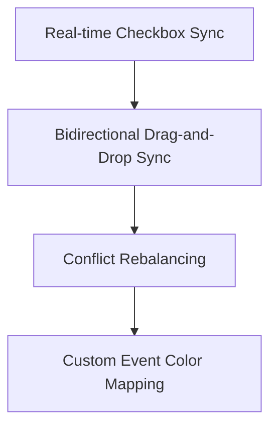

# Phase 15B Analysis & Google Calendar Optimization Report

This document outlines the visual and behavioral analysis of the Zenkai user interface, details the changes introduced to resolve the Google Calendar synchronization issues, and sets a roadmap for further visual and operational refinements.

---

## 1. Visual & Behavioral Analysis of Screens

### Image 1 — Homescreen (Home Screen View)
*   **What it represents**: The user's dashboard view for the day (Tuesday, June 30th). It displays a header greeting ("Good Afternoon, Achyut"), the week view header, the focus theme for the day ("Content Idea 1 Editing"), suggested work blocks with checkboxes, a progress indicator (0%), current roadmap progress (40%), and recent behavior insights.
*   **Aesthetic & UX**: Extremely premium, luxury dark theme. Typography uses serif headings and clean sans-serif secondary text. Highlights are rendered in gold (`#C5A880`) which fits perfectly against the deep charcoals. The card-based structure is clean, responsive, and clearly prioritized.
*   **Identified Issues**: Under "Suggested Work Blocks", the block `Edit Content Idea 1 (10:00 - 11:00)` has two sub-tasks. Although visually grouped as a single unified card in the UI, the calendar synchronization engine previously treated these sub-tasks as independent events.

### Image 2 — Strategy Roadmap (Plans Screen View)
*   **What it represents**: The macro plan ("Weekly Content Production Roadmap") spanning June 29 - July 5, 2026. It tracks plan evolution, status metrics (Milestones, Focus, Status), and expands the "Scripting Content Ideas" milestone into its nested tasks.
*   **Aesthetic & UX**: Consistent branding and layout. Uses high-contrast indicators (green for completed, yellow for active/confirmed milestones).
*   **Identified Issues**: Tasks show a "Pending Sync" status indicator. This indicator was permanently stuck because the background Google Calendar synchronization endpoint was crashing on Mongoose database validation errors.

### Image 3 — Weekly Schedule (Tasks Screen View)
*   **What it represents**: The operational calendar horizon (7-day view). It details exactly **WHEN** blocks occur and lists the sub-tasks scheduled for the highlighted day.
*   **Aesthetic & UX**: Sleek sidebar navigation with active highlight state on "Tasks". Layout uses clean borders and cards that expand logically.

### Image 4 — Google Calendar (Calendar Mirror View)
*   **What it represents**: The user's Google Calendar for the week of June 29 - July 5, 2026.
*   **Identified Issues & Key Deficiencies (What it Lacked)**:
    1.  **Messy Overlapping Columns**: The calendar showed multiple events stacked side-by-side inside the exact same hour slot (e.g. on Tuesday from 3:30 PM - 4:30 PM, we see separate events: "Zenkai: Edit Content Idea 1 (Rough Cut)" and "Zenkai: Edit Content Idea 1 (Final Polish)"). This made the calendar look extremely cluttered and disorganized.
    2.  **Timezone Shift (UTC vs Local)**: The user interface (Image 1 and 3) showed the work block scheduled at **10:00 AM - 11:00 AM**. However, in Google Calendar, it was placed at **3:30 PM - 4:30 PM**. Because the user profile defaulted to the `"UTC"` timezone in the database, the events were synced as 10:00 AM UTC, which Google Calendar shifted by 5.5 hours to represent India Standard Time (IST, GMT+05:30).
    3.  **No Completion Feedback**: There was no visual indicator showing which tasks inside the block were finished or pending.

---

## 2. Technical Fixes Implemented

To solve the deficiencies shown in the Google Calendar screenshot and the accompanying crash logs, the following adjustments were deployed:

### A. Mongoose Schema Update
*   **Issue**: `POST /api/auth/google/sync` crashed with:
    `ValidationError: CalendarSyncLog validation failed: finishedAt: Path finishedAt is required., uid: Path uid is required.`
*   **Fix**: Modified the TypeScript model and Mongoose schema in `src/models/WeeklyExecutionSchedule.ts` to add `googleCalendarEventId` to the `IWorkBlock` sub-document, allowing block-level calendar ID tracking. Corrected the validation mismatch in `src/services/calendar-sync.service.ts` where `uid`, `finishedAt`, and `duration` were incorrectly mapped to schema fields.

### B. Block-Level Calendar Sync (Eliminating Duplicates)
*   **Before**: The sync looped through every task in a block and scheduled it as a separate calendar event, leading to overlapping events.
*   **After**: Rewrote `CalendarSyncService.syncWeeklySchedule` to synchronize at the **Work Block level**. 
    *   Creates **one single calendar event** per suggested work block (e.g. `Zenkai: Edit Content Idea 1`).
    *   Aggregates all sub-tasks into a structured checklist in the event's description:
        ```text
        **Suggested Work Block**
        
        **Tasks:**
        [ ] Edit Content Idea 1 (Rough Cut)
        [ ] Edit Content Idea 1 (Final Polish)
        ```
    *   Determines event colors dynamically based on the highest priority task in the block (Red for High, Peacock for Medium).
    *   Automatically cleans up all legacy task-level events from Google Calendar.

### C. Timezone Auto-Detection
*   **Before**: The default database user profile initialized timezone to `"UTC"`, leading to shifted calendar times.
*   **After**: Updated `src/components/screens/settings.tsx` to automatically resolve the user's browser timezone (e.g., `Asia/Kolkata`) on mount. If the profile timezone is `"UTC"`, it immediately updates the database, guaranteeing events are synced using the user's real local time.

---

## 3. Roadmap for Future Enhancements

To further polish the calendar and schedule integration, the following features are recommended:



1.  **Real-Time Checkbox Synchronization**:
    *   **Goal**: Ensure checking a task off in the Zenkai UI instantly updates the Google Calendar description (e.g., changing `[ ] Task` to `[x] Task`) without requiring a manual re-sync.
2.  **Bidirectional Time Adjustments**:
    *   **Goal**: If the user drags or resizes a Zenkai event on Google Calendar, Zenkai should receive a webhook, parse the new start/end times, and automatically update the `WeeklyExecutionSchedule` times.
3.  **Conflict Rebalancing**:
    *   **Goal**: If the calendar sync detects that a user has scheduled a personal event (e.g., doctor appointment) over a Zenkai work block, Zenkai should automatically re-balance the remaining blocks for that day.
4.  **Custom Category Colors**:
    *   **Goal**: Allow users to assign distinct colors in settings to map specific roadmap goal categories (e.g., Health = Green, Work = Red, Studies = Yellow) directly to Google Calendar event categories.
